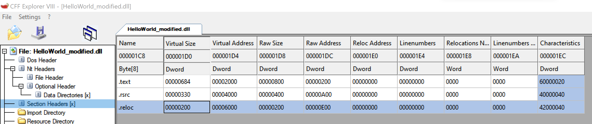

Build a dotnet pe to trigger this issue [VirusTotal#1708](https://github.com/VirusTotal/yara/issues/1708)

## Build a normal dotnet pe

`HelloWorld_origin.dll`

The size of pe should preferably be a multiple of pagesize,  because we can only cause a maximum of 16 bytes out of bounds read.

## Edit Pe file 

1. Write a metadata header at the end of file:

   

   The last 4 bytes is the `Length`, `Length` must <= 16 to trigger the issue, and of course it must also be a legal value:

   ```c
   // yara/libyara/modules/dotnet:1652
   if (md_len == 0 || md_len > 255 || md_len % 4 != 0 ||
       !fits_in_pe(pe, pe->data + offset, md_len))
   {
     return false;
   }
   ```

2. Edit the last section header, make `Virtual Size` be the same as `Raw Size`, otherwise the metadata header at the end of file will not be considered as part of pe.

   

3. Edit the `MetaDataRVA` to the RVA metadata header we write at the end of file

   

## Scan the modified PE file

```yara
import "dotnet"

rule dotnet_version_rule
{
    condition:
        dotnet.version == "v4.0.30319"
}
```


